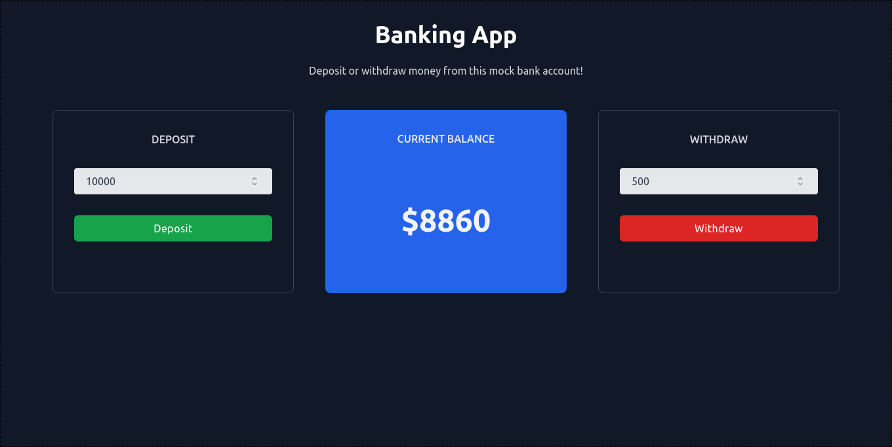

# Banking App

A basic banking application for depositing and withdrawing amounts from a faux bank account.  Uses [Redux](https://redux-toolkit.js.org/) as a global store as well as React hooks to control the state.  [Tailwind](https://tailwindcss.com/docs/installation) for CSS framework.

## Try it out!

Click [here](https://thereeling.github.io/mv_frontend_challenge_1/) to try it out in your browser using GitHub pages.

## Build

If you wish to run this app locally and run your own build, follow these steps:

1. Download the ZIP from GitHub.

2. Extract the contents

3. Open the root directory in your preferred text editor or terminal.

4. Run the command `npm install`, this will install all necessary dependencies.

5. Once finished, run the command `npm start` to start the React app.

6. The app should now be running in your browser!

### License

MIT License

Copyright (c) 2022 Nicholas Giuliani

Permission is hereby granted, free of charge, to any person obtaining a copy
of this software and associated documentation files (the "Software"), to deal
in the Software without restriction, including without limitation the rights
to use, copy, modify, merge, publish, distribute, sublicense, and/or sell
copies of the Software, and to permit persons to whom the Software is
furnished to do so, subject to the following conditions:

The above copyright notice and this permission notice shall be included in all
copies or substantial portions of the Software.

THE SOFTWARE IS PROVIDED "AS IS", WITHOUT WARRANTY OF ANY KIND, EXPRESS OR
IMPLIED, INCLUDING BUT NOT LIMITED TO THE WARRANTIES OF MERCHANTABILITY,
FITNESS FOR A PARTICULAR PURPOSE AND NONINFRINGEMENT. IN NO EVENT SHALL THE
AUTHORS OR COPYRIGHT HOLDERS BE LIABLE FOR ANY CLAIM, DAMAGES OR OTHER
LIABILITY, WHETHER IN AN ACTION OF CONTRACT, TORT OR OTHERWISE, ARISING FROM,
OUT OF OR IN CONNECTION WITH THE SOFTWARE OR THE USE OR OTHER DEALINGS IN THE
SOFTWARE.
